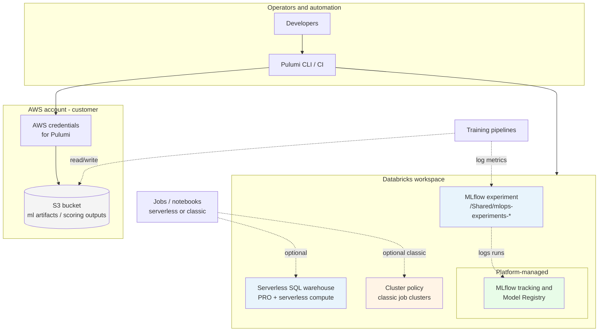

# databricks-mlops-aws

Starter [Pulumi](https://www.pulumi.com/) infrastructure for **Databricks MLOps on AWS**: S3 for artifacts, a shared **MLflow** experiment, a **serverless SQL** warehouse, and a **classic job cluster policy** for cost and tag guardrails.

## Architecture

The diagram below shows what this repository provisions today (solid lines), how it fits into a broader MLOps platform (dashed), and typical extension points.

**Source file (for [Mermaid Live Editor](https://mermaid.live/), Confluence, Notion, or [`mermaid-cli`](https://github.com/mermaid-js/mermaid-cli)):** [`docs/databricks-mlops-aws-architecture.mmd`](docs/databricks-mlops-aws-architecture.mmd)



### Legend

| Element | Meaning |
|--------|---------|
| **S3** | Created by Pulumi: versioning, SSE-S3, block public access. |
| **MLflow experiment** | Workspace object for shared experiment paths; tracking/registry remain Databricks-managed. |
| **Serverless SQL warehouse** | Databricks-managed compute (no EC2 in your account for this path). Requires [serverless SQL eligibility](https://docs.databricks.com/sql/admin/serverless.html) on your workspace. |
| **Cluster policy** | Applies to **classic** VM-backed clusters only, not serverless SQL. |
| Dashed boxes | Common next steps (jobs, training code, bundles)—not defined in this minimal stack. |

## What this stack creates

| Resource | Provider | Purpose |
|----------|----------|---------|
| S3 bucket + versioning + encryption + public access block | AWS | Model artifacts, batch outputs, future UC roots |
| `MlflowExperiment` | Databricks | `/Shared/mlops-experiments-{environment}` |
| `SqlEndpoint` (serverless) | Databricks | `mlops-serverless-sql-{environment}` |
| `ClusterPolicy` | Databricks | Caps workers and node types for classic job clusters |

## Prerequisites

- [Pulumi CLI](https://www.pulumi.com/docs/install/)
- [Python 3.9+](https://www.python.org/downloads/)
- AWS credentials configured for the target account (`aws configure`, environment variables, or IAM role)
- A Databricks workspace on AWS and a [personal access token](https://docs.databricks.com/dev-tools/auth.html#personal-access-tokens) (or equivalent for CI)

## Quick start

```bash
cd infra
python3 -m venv venv
source venv/bin/activate   # Windows: venv\Scripts\activate
pip install -r requirements.txt

cp Pulumi.dev.yaml.example Pulumi.dev.yaml
# Edit Pulumi.dev.yaml: set databricks:host and aws:region as needed.

pulumi stack init dev
pulumi config set --secret databricks:token '<your-pat>'

pulumi preview
pulumi up
```

## Configuration

| Key | Namespace | Description |
|-----|-----------|-------------|
| `environment` | `databricks-mlops-aws` | Suffix for resource names (default: `dev` if unset in code). |
| `aws:region` | `aws` | Region for S3 and the default provider. |
| `host` | `databricks` | Workspace URL, e.g. `https://dbc-xxxx.cloud.databricks.com`. |
| `token` | `databricks` | PAT (store with `pulumi config set --secret`). |

Alternatively, the Databricks provider can use `DATABRICKS_HOST` and `DATABRICKS_TOKEN` environment variables instead of Pulumi config.

## Stack outputs

After `pulumi up`, exports include:

- `aws_region`
- `ml_artifacts_bucket`
- `mlflow_experiment_id`
- `serverless_sql_warehouse_id`
- `ml_job_cluster_policy_id`

## Repository layout

```
DataBricks/
├── README.md                 # This file
├── docs/
│   └── databricks-mlops-aws-architecture.mmd   # Mermaid diagram source
└── infra/
    ├── Pulumi.yaml           # Project name and Python runtime
    ├── Pulumi.dev.yaml.example
    ├── requirements.txt      # pulumi-aws, pulumi-databricks
    ├── __main__.py           # Stack definition
    └── .gitignore
```

Copy `Pulumi.dev.yaml.example` to `Pulumi.dev.yaml` locally; real stack files with secrets are gitignored.

## Extensions (typical next steps)

- **Unity Catalog**: external locations, storage credentials, catalogs and grants (often account-level).
- **IAM**: instance profiles or storage credentials so Databricks can read/write the S3 bucket; bucket policies aligned with your workspace deployment model.
- **Jobs and bundles**: [Databricks Asset Bundles](https://docs.databricks.com/dev-tools/bundles/index.html) plus Pulumi or CI for job deployment.
- **Model Serving**: `ModelServing` resources once you have endpoint configuration.
- **CI/CD**: GitHub Actions (or similar) with OIDC to AWS and encrypted Pulumi stacks.

## References

- [Databricks on AWS](https://docs.databricks.com/getting-started/overview.html)
- [Pulumi AWS](https://www.pulumi.com/registry/packages/aws/) and [Pulumi Databricks](https://www.pulumi.com/registry/packages/databricks/) packages
- [Serverless SQL warehouses](https://docs.databricks.com/sql/admin/serverless.html)

## License

Use and modify according to your organization’s policies.
