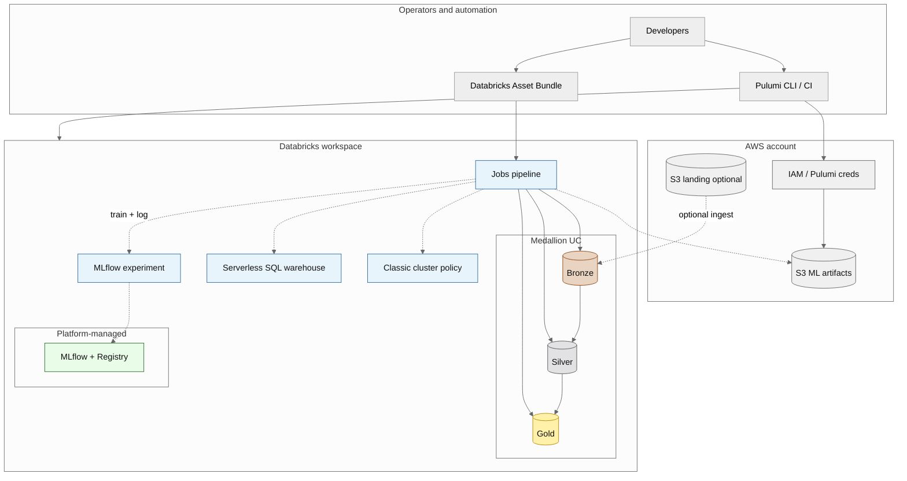

# databricks-mlops-aws

Starter template for **Databricks on AWS** that combines:

1. **[Medallion lakehouse architecture](https://docs.databricks.com/aws/en/lakehouse/medallion)** — logical **Bronze → Silver → Gold** layers (raw → validated → analytics-ready).
2. **MLOps-oriented infrastructure** — [Pulumi](https://www.pulumi.com/) provisions S3, a shared **MLflow** experiment path, a **serverless SQL** warehouse, and a **classic job cluster policy**.
3. **Databricks Asset Bundle** — a single job pipeline runs the template notebooks in order through Gold, then a minimal MLflow training step.

## Medallion layout in this repository

| Layer | Folder | What the template does |
|-------|--------|-------------------------|
| **Bronze** | [`medallion/bronze/`](medallion/bronze/) | Append string-typed “raw” events with ingest metadata (`raw_events`). Production systems usually read from S3 or streaming sources instead of the in-notebook sample. |
| **Silver** | [`medallion/silver/`](medallion/silver/) | Type, trim, filter nulls, dedupe by key → `events_validated`. |
| **Gold** | [`medallion/gold/`](medallion/gold/) | Daily aggregates by region → `daily_region_metrics` for BI and ML features. |
| **MLOps** | [`mlops/notebooks/`](mlops/notebooks/) | Read Gold, train a small sklearn model, log to MLflow. |

SQL equivalents live under each layer’s `sql/` directory for teams that prefer Warehouse/SQL pipelines.

The sample domain is generic (event ids, dates, amounts, regions); replace tables and transforms with your own sources.

## Architecture

The diagrams show **AWS** (S3, IAM), **Databricks** (medallion layers, jobs, MLflow, SQL warehouse, cluster policy), and how **Pulumi** and **Asset Bundles** fit in.

### Mermaid sources (pick by renderer)

| File | Diagram type | Best for |
|------|----------------|----------|
| [`docs/databricks-mlops-aws-architecture.mmd`](docs/databricks-mlops-aws-architecture.mmd) | [`architecture-beta`](https://mermaid.js.org/syntax/architecture.html) (YAML frontmatter, groups, built-in icons) | Cloud-style service map in [Mermaid Live](https://mermaid.live/) or **Mermaid v11.1+** |
| [`docs/databricks-mlops-aws-layers.mmd`](docs/databricks-mlops-aws-layers.mmd) | [`block-beta`](https://mermaid.js.org/syntax/block.html) (column grid, link labels, `classDef`) | Fixed layout “layers” view; **Mermaid v11+** |
| [`docs/databricks-mlops-aws-flowchart.mmd`](docs/databricks-mlops-aws-flowchart.mmd) | `flowchart` + [`%%{init}%%`](https://mermaid.js.org/config/directives.html) (neutral theme, **ELK** layout, `classDef`) | Wide tooling support; ELK gives cleaner layout where the runtime [registers the ELK loader](https://mermaid.js.org/config/layouts.html) |

`mmdc` renders **one** diagram per input file. Export examples:

```bash
npx @mermaid-js/mermaid-cli -i docs/databricks-mlops-aws-architecture.mmd -o docs/out/architecture-beta.svg
npx @mermaid-js/mermaid-cli -i docs/databricks-mlops-aws-layers.mmd -o docs/out/layers-block.svg
npx @mermaid-js/mermaid-cli -i docs/databricks-mlops-aws-flowchart.mmd -o docs/out/flowchart-elk.svg
```

The preview below matches the flowchart file but **omits the ELK renderer** so it stays compatible with common Markdown hosts (for example GitHub) that do not load the ELK plugin.



### Legend

| Element | Meaning |
|--------|---------|
| **Bronze / Silver / Gold** | Unity Catalog schemas in this template: `{catalog}.bronze`, `.silver`, `.gold` (default catalog `main`). |
| **S3 (artifacts)** | Bucket created by Pulumi for models, batch outputs, future UC external locations. |
| **S3 (landing)** | Optional raw file landing; Bronze notebooks can read `s3://` paths on AWS. |
| **Job pipeline** | Defined in [`databricks.yml`](databricks.yml); tasks run notebooks in medallion + `mlops` order. |
| **MLflow experiment** | Workspace experiment path from Pulumi: `/Shared/mlops-experiments-{environment}`. |
| **Serverless SQL warehouse** | Databricks-managed; requires [serverless SQL eligibility](https://docs.databricks.com/sql/admin/serverless.html). |
| **Cluster policy** | Applies to **classic** VM-backed clusters (for example bundle job clusters), not serverless SQL. |
| Dashed arrows | Optional or platform-managed paths. |

## What the Pulumi stack creates

| Resource | Provider | Purpose |
|----------|----------|---------|
| S3 bucket + versioning + encryption + public access block | AWS | Model artifacts, batch outputs, future UC roots |
| `MlflowExperiment` | Databricks | `/Shared/mlops-experiments-{environment}` |
| `SqlEndpoint` (serverless) | Databricks | `mlops-serverless-sql-{environment}` |
| `ClusterPolicy` | Databricks | Caps workers and node types for classic job clusters |

## Prerequisites

- [Pulumi CLI](https://www.pulumi.com/docs/install/)
- [Python 3.9+](https://www.python.org/downloads/)
- AWS credentials for the target account
- Databricks workspace on AWS and a [personal access token](https://docs.databricks.com/dev-tools/auth.html#personal-access-tokens) (or CI auth)
- [Databricks CLI](https://docs.databricks.com/dev-tools/cli/index.html) with bundle support, to deploy [`databricks.yml`](databricks.yml)

## Quick start — infrastructure

```bash
cd infra
python3 -m venv venv
source venv/bin/activate   # Windows: venv\Scripts\activate
pip install -r requirements.txt

cp Pulumi.dev.yaml.example Pulumi.dev.yaml
# Edit Pulumi.dev.yaml: set databricks:host and aws:region as needed.

pulumi stack init dev
pulumi config set --secret databricks:token '<your-pat>'

pulumi preview
pulumi up
```

## Quick start — medallion + MLOps notebooks (bundle)

1. Edit [`databricks.yml`](databricks.yml): set `targets.dev.workspace.host` to your workspace URL.
2. Align `variables.experiment_path` with the experiment name Pulumi created (for example `/Shared/mlops-experiments-dev`).
3. Adjust `variables.spark_version` and `job_clusters` `node_type_id` to match runtimes available in your region.

```bash
# From repository root
databricks bundle validate
databricks bundle deploy --target dev
```

Run the deployed job from the Databricks UI, or `databricks bundle run medallion_mlops_pipeline --target dev` (exact CLI may vary by CLI version).

You can also import or copy individual notebooks under `medallion/` and `mlops/` into the workspace and run them manually in Bronze → Silver → Gold → ML order.

## Configuration

| Key | Namespace | Description |
|-----|-----------|-------------|
| `environment` | `databricks-mlops-aws` | Suffix for resource names (default `dev` in code if unset). |
| `aws:region` | `aws` | Region for S3 and the default AWS provider. |
| `host` | `databricks` | Workspace URL, e.g. `https://dbc-xxxx.cloud.databricks.com`. |
| `token` | `databricks` | PAT (`pulumi config set --secret`). |

Environment variables `DATABRICKS_HOST` and `DATABRICKS_TOKEN` can be used instead of Pulumi config for the Databricks provider.

### Bundle variables (`databricks.yml`)

| Variable | Purpose |
|----------|---------|
| `catalog` | Unity Catalog catalog for `bronze` / `silver` / `gold` schemas (default `main`). |
| `spark_version` | Cluster runtime for the job (must exist in your workspace). |
| `experiment_path` | MLflow experiment for the training notebook. |

## Stack outputs

After `pulumi up`:

- `aws_region`
- `ml_artifacts_bucket`
- `mlflow_experiment_id`
- `serverless_sql_warehouse_id`
- `ml_job_cluster_policy_id`

Attach `ml_job_cluster_policy_id` to bundle job clusters if you want the same guardrails (requires updating `databricks.yml` to reference the policy).

## Repository layout

```
DataBricks/
├── README.md
├── databricks.yml              # Asset Bundle: medallion + ML training job
├── docs/
│   ├── databricks-mlops-aws-architecture.mmd   # architecture-beta (v11.1+)
│   ├── databricks-mlops-aws-layers.mmd         # block-beta layers (v11+)
│   └── databricks-mlops-aws-flowchart.mmd      # flowchart + ELK + classDef
├── medallion/
│   ├── README.md
│   ├── bronze/                 # Raw landing templates
│   ├── silver/                 # Validation / dedupe templates
│   └── gold/                   # Curated aggregates templates
├── mlops/
│   ├── README.md
│   └── notebooks/              # MLflow training template
└── infra/
    ├── Pulumi.yaml
    ├── Pulumi.dev.yaml.example
    ├── requirements.txt
    ├── __main__.py
    └── .gitignore
```

## Extensions (typical next steps)

- **Unity Catalog**: external locations on the S3 bucket, storage credentials, grants — align Bronze reads with `EXTERNAL LOCATION` and managed ingestion.
- **Lakeflow / Delta Live Tables**: orchestrate Bronze→Silver→Gold with expectations and SLAs.
- **Feature Store**: publish Gold or Silver tables as feature tables for training and serving.
- **Model Serving**: deploy registered models to serverless or classic serving endpoints.
- **CI/CD**: GitHub Actions with OIDC to AWS, `pulumi up`, and `databricks bundle deploy` on merge.

## References

- [Mermaid architecture diagrams (`architecture-beta`)](https://mermaid.js.org/syntax/architecture.html)
- [Mermaid block diagrams (`block-beta`)](https://mermaid.js.org/syntax/block.html)
- [Mermaid layouts (ELK, etc.)](https://mermaid.js.org/config/layouts.html)
- [What is the medallion lakehouse architecture?](https://docs.databricks.com/aws/en/lakehouse/medallion) (Databricks on AWS)
- [Databricks Asset Bundles](https://docs.databricks.com/dev-tools/bundles/index.html)
- [Databricks on AWS](https://docs.databricks.com/getting-started/overview.html)
- [Pulumi AWS](https://www.pulumi.com/registry/packages/aws/) and [Pulumi Databricks](https://www.pulumi.com/registry/packages/databricks/)
- [Serverless SQL warehouses](https://docs.databricks.com/sql/admin/serverless.html)

## License

Use and modify according to your organization’s policies.
